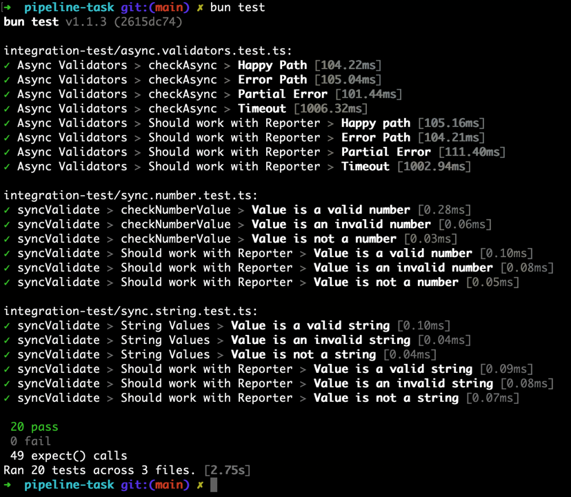

# Project's structure
  - [src](src) - Root source directory
  - [integration-test](integration-test) - Integration tests
  - [package.json](package.json) - Project configuration

# The task
The main goal of this task is to create a list of functions that will be used as it described in the integration tests.

# Requirements
- The code should be written in TypeScript.
- The existing integration tests should pass.
- The existing integration tests should not be modified.
- If you need to add new tests, you can do it in a separate test file.

